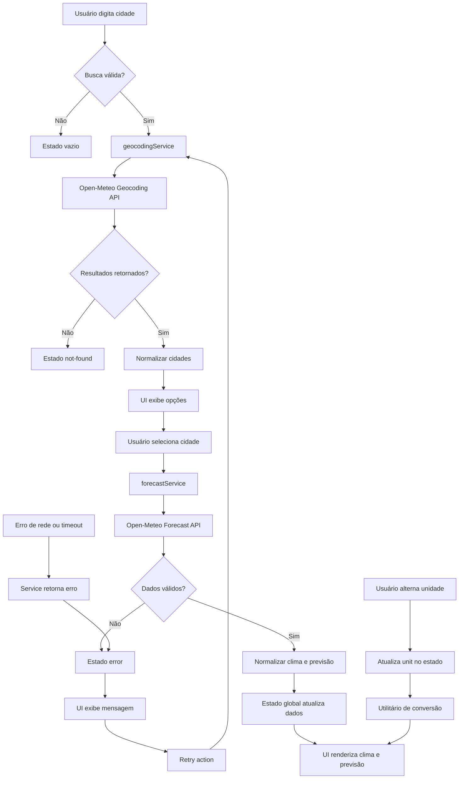

# Plano Técnico — Weather App

## Architecture Overview

A arquitetura proposta é uma aplicação frontend em React com Vite, organizada em camadas simples e bem separadas:

- Camada de apresentação: componentes React responsáveis por renderizar estado, formulários, cartões do clima e mensagens de erro.
- Camada de orquestração: hooks e funções que coordenam busca, seleção da cidade, carregamento de dados e sincronização do estado global.
- Camada de serviço: cliente HTTP isolado para geocodificação e leitura de previsão usando a API Open-Meteo.
- Camada de domínio: tipos e funções puras para normalizar dados, converter unidade e traduzir códigos meteorológicos.

A solução será mobile-first, com uma página principal contendo busca, clima atual, previsão de cinco dias e switch de unidade. Não haverá backend, banco ou autenticação na primeira versão; toda a lógica será executada no cliente, com dados recebidos diretamente da API pública.

Diagrama conceitual:

- Usuário -> busca -> hook -> service de geocoding -> cidade selecionada -> service de forecast -> estado -> UI
- Usuário -> alterna unidade -> função de conversão -> renderização sem novo request
- Falha de rede/timeout -> estado de erro -> action de retry -> nova consulta

## Tech Stack

- React 19: renderização declarativa e padrões de componentes simples.
- Vite: ambiente de desenvolvimento e build rápidos.
- TypeScript: tipagem estática para melhorar contratos entre dados, serviços e UI.
- Tailwind CSS: layout responsivo, mobile-first e visual dark glassmorphism.
- Vitest + Testing Library: testes unitários e de interação para lógica e componentes.
- Playwright: testes E2E do fluxo principal de busca, seleção e erro em viewport mobile.
- Open-Meteo: geocodificação e previsão meteorológica, sem necessidade de API key.
- Biome: lint e formatação consistentes.

Justificativa:

- A stack é adequada ao escopo inicial, sem complexidade de backend.
- React + TypeScript reduz ambiguidade entre dados da API e renderização.
- Tailwind acelera prototipagem e mantém consistência visual.
- Vitest e Playwright cobrem a camada unitária e o fluxo end-to-end com baixa manutenção.

## Project Structure

A estrutura proposta é esta:

- src/
  - components/
    - SearchCityForm
    - CitySelector
    - WeatherCurrentCard
    - ForecastList
    - UnitToggle
    - ErrorState
    - LoadingState
    - EmptyState
  - hooks/
    - useWeatherSearch
    - useCitySearch
    - useTemperatureUnit
  - services/
    - openMeteoClient
    - geocodingService
    - forecastService
  - lib/
    - temperature.ts
    - dateFormatting.ts
    - weatherCodeMapper.ts
  - types/
    - city.ts
    - weather.ts
    - api.ts
  - App.tsx
  - styles/
    - global.css

Observações:

- A separação por camadas mantém apresentação, estado e acesso a dados desacoplados.
- Componentes ficam concentrados em UI e interações simples.
- Hooks assumem orquestração do fluxo principal e estado compartilhado.
- Services isolam o cliente HTTP e o parsing da API pública.
- A pasta lib/ guarda funções puras, sem efeitos colaterais, ideais para testes automatizados.
- A convenção do projeto é respeitada: `components`, `hooks`, `services`, `types`, e a camada `lib` complementa o conjunto de funções puras e reutilizáveis.

Essa separação facilita os testes porque cada responsabilidade pode ser validada por unidade sem acoplar a interface ao provedor externo.

## Data Model

Os dados do sistema devem seguir contratos mínimos e bem definidos. As temperaturas são armazenadas em Celsius; a unidade escolhida pelo usuário é aplicada somente na apresentação, sem novo request à API.

```ts
export type Unit = 'celsius' | 'fahrenheit';

export interface City {
  id: number;
  name: string;
  country: string;
  countryCode?: string;
  admin1?: string;
  admin2?: string;
  latitude: number;
  longitude: number;
  timezone: string;
  label: string;
}

export interface CurrentWeather {
  temperatureC: number;
  weatherCode: number;
  weatherDescription: string;
  humidity?: number;
  windSpeed?: number;
  pressure?: number;
  precipitation?: number;
  observationTime: string;
}

export interface ForecastDay {
  date: string;
  dayLabel: string;
  weatherCode: number;
  weatherDescription: string;
  minTemperatureC: number;
  maxTemperatureC: number;
  precipitationProbability?: number;
  precipitationSum?: number;
}

export interface WeatherData {
  city: City;
  current: CurrentWeather;
  forecast: ForecastDay[];
}

export interface AppState {
  status: 'idle' | 'loading' | 'success' | 'empty' | 'not-found' | 'error';
  query: string;
  selectedCity: City | null;
  cities: City[];
  currentWeather: CurrentWeather | null;
  forecast: ForecastDay[];
  errorMessage: string | null;
  unit: 'C' | 'F';
}
```

Esses contratos devem ser usados como fonte de verdade entre service, estado e UI. A conversão para Fahrenheit deve ser centralizada em utilitários e aplicada em um único ponto do fluxo de apresentação.

## Data Flow

Fluxo principal:

1. Usuário digita o nome da cidade e dispara a busca.
2. Formulário valida entrada e rejeita query vazia ou composta apenas por espaços.
3. Serviço de geocodificação chama a API Open-Meteo com base no termo informado.
4. Resultado é normalizado para City[] e armazenado no estado de busca.
5. Quando há múltiplos resultados, a UI mostra opções de desambiguação.
6. Usuário seleciona a cidade correta.
7. Serviço de previsão recebe latitude, longitude e timezone da cidade.
8. Dados meteorológicos atuais e de cinco dias são normalizados.
9. Estado principal atualiza selectedCity, currentWeather e forecast.
10. UI renderiza clima atual, lista de previsão e unidade ativa.



Fluxo de alternância de unidade:

1. Usuário aciona switch Celsius/Fahrenheit.
2. Estado unit é atualizado.
3. A UI lê os valores em Celsius e aplica conversão no momento da renderização.
4. Tanto o clima atual como a previsão refletem a mesma unidade sem inconsistência.

Fluxo de erro:

1. Falha de rede, timeout ou resposta inválida.
2. Serviço retorna erro estruturado.
3. Estado é atualizado para error ou not-found.
4. UI exibe mensagem adequada e opcional de retry.
5. Retry dispara mesma operação anterior se a intenção de consulta estiver disponível.

## External APIs

### Open-Meteo Geocoding API

URL:
- https://geocoding-api.open-meteo.com/v1/search

Parâmetros relevantes:
- name: texto informado pelo usuário
- count: quantidade de resultados esperados
- language: pt
- format: json

Exemplo de request:
- https://geocoding-api.open-meteo.com/v1/search?name=Sao%20Paulo&count=5&language=pt&format=json

Exemplo resumido de resposta:

```json
{
  "results": [
    {
      "id": 3448439,
      "name": "São Paulo",
      "country": "Brazil",
      "admin1": "São Paulo",
      "admin2": "São Paulo",
      "latitude": -23.5489,
      "longitude": -46.6388,
      "timezone": "America/Sao_Paulo"
    }
  ]
}
```

Mapeamento para o modelo:
- `id` -> `City.id`
- `name` -> `City.name`
- `country` -> `City.country`
- `admin1` -> `City.admin1`
- `admin2` -> `City.admin2`
- `latitude` -> `City.latitude`
- `longitude` -> `City.longitude`
- `timezone` -> `City.timezone`
- `label` -> composto em `City.label` com `name + admin1 + country`, quando houver dados suficientes

### Open-Meteo Forecast API

URL:
- https://api.open-meteo.com/v1/forecast

Parâmetros relevantes:
- latitude
- longitude
- current: temperatura_2m, weather_code
- daily: temperature_2m_max, temperature_2m_min, weather_code
- timezone: auto
- forecast_days: 5
- temperature_unit: celsius

Exemplo de request:
- https://api.open-meteo.com/v1/forecast?latitude=-23.5489&longitude=-46.6388&current=temperature_2m,weather_code&daily=temperature_2m_max,temperature_2m_min,weather_code&timezone=auto&forecast_days=5&temperature_unit=celsius

Exemplo resumido de resposta:

```json
{
  "latitude": -23.5489,
  "longitude": -46.6388,
  "timezone": "America/Sao_Paulo",
  "current": {
    "temperature_2m": 28.4,
    "weather_code": 2,
    "time": "2026-09-02T14:00"
  },
  "daily": {
    "time": ["2026-09-02", "2026-09-03", "2026-09-04", "2026-09-05", "2026-09-06"],
    "weather_code": [2, 1, 61, 3, 0],
    "temperature_2m_max": [29.1, 28.7, 27.8, 26.9, 27.5],
    "temperature_2m_min": [21.6, 20.8, 20.1, 19.4, 20.2]
  }
}
```

Mapeamento para o modelo:
- `current.temperature_2m` -> `CurrentWeather.temperatureC`
- `current.weather_code` -> `CurrentWeather.weatherCode`
- `current.time` -> `CurrentWeather.observationTime`
- `daily.time[]` -> `ForecastDay.date` e `ForecastDay.dayLabel`
- `daily.weather_code[]` -> `ForecastDay.weatherCode`
- `daily.temperature_2m_max[]` -> `ForecastDay.maxTemperatureC`
- `daily.temperature_2m_min[]` -> `ForecastDay.minTemperatureC`
- `timezone` -> `WeatherData.city.timezone` ou `selectedCity.timezone`

### Responsabilidade da camada de serviço
- encapsular URL e parâmetros da API em `services/openMeteoClient.ts`
- converter a resposta bruta em tipos do domínio em `services/geocodingService.ts` e `services/forecastService.ts`
- tratar ausência de dados, campos nulos e listas fora de ordem antes de atualizar o estado da aplicação

## State Management

A solução usará estado local em React, sem biblioteca adicional de gerenciamento de estado. O estado vive em um componente pai `App` ou em um hook específico como `useWeatherSearch`, que expõe valores e ações para os componentes de UI.

Estratégia:

- `useState` ou `useReducer` para o estado global da aplicação
- `useReducer` recomendado para estados complexos com carregamento, erro, resultado e retry
- estados de UI isolados em componentes quando não compartilhados

Estados explícitos:
- `idle`: sem busca executada
- `loading`: busca ou forecast em andamento
- `success`: dados válidos carregados
- `error`: falha de rede, timeout ou API indisponível
- `empty`: busca concluída sem resultados

Estado principal:
- `query` / input da busca
- `selectedCity`
- `cities`
- `currentWeather`
- `forecast`
- `status`
- `unit`
- `errorMessage`

Conversão Celsius/Fahrenheit:
- Os dados brutos são armazenados em Celsius como fonte única.
- A unidade selecionada pelo usuário é um valor de apresentação (`'C' | 'F'`).
- Na renderização, a UI deriva o valor final em tempo real com uma função pura, por exemplo:
  - `toDisplayTemperature(valueC, unit)`
  - `celsiusToFahrenheit(valueC)`
- Não há novo request à API ao trocar a unidade; somente a apresentação é convertida.

## Error Handling Strategy

A estratégia deve favorecer clareza e recuperação sem quebrar a interface.

### Casos tratados
- `rede`: falha de comunicação, offline ou DNS
- `API`: resposta inválida, JSON malformado, estrutura inesperada
- `timeout`: requisição lenta e cancelada
- `resposta parcial`: campos ausentes em `current` ou `daily`
- `empty`: sem resultados para a cidade pesquisada

### Regras
- Não mostrar resultados antigos como se fossem do estado atual após uma nova busca.
- Mensagens em pt-BR, curtas e objetivas, sem expor stack trace.
- Retry action sempre presente quando a falha for recuperável.
- Tratamento defensivo para API inválida, resposta em branco e campos ausentes.
- Em caso de resposta parcial, a aplicação usa fallback ao estado de erro ou mensagem de dados incompletos.

### Estratégia de retry
- Guardar a última intenção de busca, incluindo termo e cidade selecionada.
- Permitir nova tentativa sem recarregar a página inteira.
- Em caso de falha prolongada, manter o estado de erro até nova ação do usuário.

## Testing Strategy

### Vitest
Cobrir:
- conversão Celsius/Fahrenheit em função pura
- normalização de dados da API
- validação da sequência de cinco dias e ordenação cronológica
- mapeamento de `weather_code` para descrição em pt-BR
- validação de query vazia e busca sem resultado
- tratamento de erros de rede, timeout e resposta parcial
- utilitários de label e formatação de data para pt-BR

### Testing Library / componentes
Cobrir:
- renderização do estado idle
- estado de loading visível
- estado de erro e action de retry
- estado empty para busca sem resultados
- sucesso com clima atual e previsão
- alternância de unidade sem novo request
- estados acessíveis por teclado e com labels semânticos

### Playwright
Fluxos prioritários:
1. buscar cidade existente e visualizar clima atual
2. buscar uma cidade com nomes ambíguos e selecionar a correta
3. alternar Celsius/Fahrenheit e verificar consistência na UI
4. cenário de cidade não encontrada
5. cenário de falha de rede e retry
6. validação do layout em viewport mobile e desktop

Critério de qualidade:
- Os testes devem refletir o comportamento real da aplicação sem depender de mocks excessivos do estado da UI.

## Risks & Trade-offs

### Riscos técnicos
- Dependência de uma API pública pode gerar indisponibilidade ou mudança de contrato.
- Respostas incompletas da API podem quebrar a UI se não houver validação.
- Conversão de unidades pode divergir entre componentes se não houver utilitário único.
- Falhas de rede e timeout precisam ser traduzidas para UX clara para não gerar confiança errada.

### Trade-offs
- Simplicidade versus recursos extras: a aplicação prioriza busca, clima atual e previsão em cinco dias, sem backend ou cache sofisticado.
- Estado local versus gerenciamento externo: o estado local é suficiente para a v1, evitando over-engineering.
- API pública sem chave versus controle operacional: a escolha reduz complexidade, mas exige tolerância a falhas e feedback claro ao usuário.
- Manter dados em Celsius no domínio versus converter em cada componente: a primeira opção reduz inconsistências e testes duplicados.

### Alternativas consideradas
- Redux/Zustand: descartado para v1 por adicionar overhead sem benefício mensurável no escopo atual.
- Backend próprio: descartado pela regra de escopo e pela simplicidade do produto.
- Cache complexificado: adiado para versões futuras, pois não é requisito da primeira entrega.

### Decisões adotadas
- Sem autenticação.
- Sem backend próprio.
- Sem favoritos, histórico e geolocalização automática.
- Celsius como padrão e alternância para Fahrenheit.
- Previsão diária de cinco dias, começando hoje.

Essas decisões estão alinhadas com a spec e preservam um escopo viável para a primeira entrega sem comprometer a clareza do produto.
