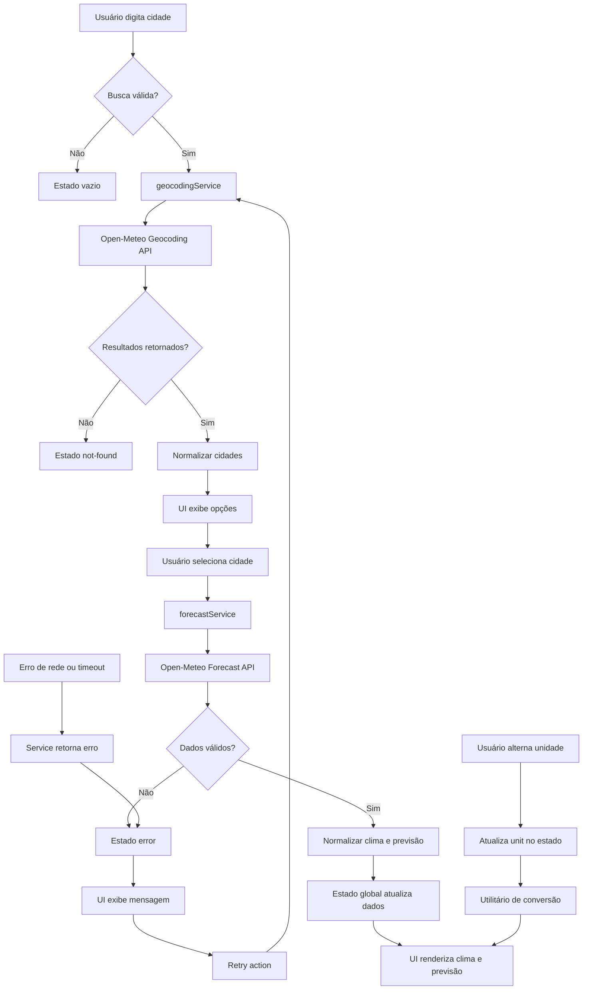

# Plano Técnico — Weather App

## Architecture Overview

A arquitetura proposta é uma aplicação frontend em React com Vite, organizada em camadas simples e bem separadas:

- Camada de apresentação: componentes React responsáveis por renderizar estado, formulários, cartões do clima e mensagens de erro.
- Camada de aplicação: hooks e funções de orquestração que coordenam busca, seleção da cidade, conversão de unidade e recomposição do estado.
- Camada de serviço: cliente HTTP dedicado para geocodificação e consulta de previsão meteorológica usando a API Open-Meteo.
- Camada de domínio: tipos e utilitários para normalizar dados de cidade, clima atual e previsão, além da conversão Celsius/Fahrenheit.

A solução será mobile-first, com uma página principal contendo busca, resultado atual, previsão dos próximos cinco dias e um switch de unidade. Não haverá backend, banco ou autenticação na primeira versão; toda a lógica será executada no cliente, com dados recebidos diretamente da API pública.

Diagrama conceitual:

- Usuário -> Busca em input -> Serviço de geocodificação -> Seleção de cidade -> Serviço de previsão -> Estado da aplicação -> UI
- Usuário -> Alternância de unidade -> Utilitário de conversão -> Re-render da UI
- Falha de rede/timeout -> Estado de erro -> Retry action -> nova consulta

## Tech Stack

- React 19: renderização declarativa e padrões de componentes simples.
- Vite: ambiente de desenvolvimento e build rápidos.
- TypeScript: tipagem estática para garantir contratos entre dados, serviços e UI.
- Tailwind CSS: velocidade de layout, mobile-first e design dark glassmorphism.
- Vitest + Testing Library: testes unitários e de interação para lógica e componentes.
- Playwright: testes E2E do fluxo principal de busca, seleção e erro.
- Open-Meteo: geocodificação e previsão meteorológica, sem necessidade de API key.
- Biome: lint e formatação consistentes.

Justificativa:

- A stack é adequada ao escopo inicial, sem complexidade de backend.
- React + TypeScript reduz ambiguidade entre dados da API e renderização.
- Tailwind acelera prototipagem e mantém consistência visual.
- Vitest e Playwright cobrem a camada unitária e o fluxo end-to-end com baixa manutenção.

## Project Structure

A estrutura proposta é a seguinte:

- src/
  - components/
    - SearchCityForm
    - CitySelector
    - WeatherCurrentCard
    - ForecastList
    - UnitToggle
    - ErrorState
    - LoadingState
    - EmptyState
  - hooks/
    - useWeatherSearch
    - useCitySearch
    - useTemperatureUnit
  - services/
    - openMeteoClient
    - geocodingService
    - forecastService
  - utils/
    - temperature
    - dateFormatting
    - weatherCodeMapper
  - types/
    - city.ts
    - weather.ts
    - api.ts
  - app/
    - App.tsx
    - state orchestration
  - styles/
    - global.css

Observações:

- Um componente por arquivo, seguindo a convenção do projeto.
- A lógica de acesso à API fica isolada em services/ para facilitar testes e trocar provedor no futuro.
- Funções puras e utilitárias ficam em utils/ para garantir previsibilidade.
- A conversão de unidade e o mapeamento de códigos climáticos devem ser tratadas como camada de domínio, não como lógica espalhada na UI.

## Data Model

Os dados do sistema devem seguir contratos mínimos e bem definidos. As
temperaturas são armazenadas em Celsius; a unidade escolhida pelo usuário é
aplicada somente na apresentação, sem novo request à API.

```ts
export type Unit = 'celsius' | 'fahrenheit';

export interface City {
  id: number; // Identificador da localidade no serviço de geocodificação.
  name: string; // Nome da cidade.
  country: string; // Nome ou código do país.
  countryCode?: string; // Código ISO do país, quando fornecido.
  admin1?: string; // Estado, província ou primeira divisão administrativa.
  admin2?: string; // Região ou segunda divisão administrativa.
  latitude: number; // Latitude em graus decimais.
  longitude: number; // Longitude em graus decimais.
  timezone: string; // Fuso horário da localidade.
  label: string; // Texto de desambiguação para a seleção na busca.
}

### SearchResult
- city: City
- matchedName: string
- isExactMatch: boolean

### CurrentWeather

```ts
export interface CurrentWeather {
  temperatureC: number; // Temperatura atual em Celsius (temperature_2m).
  weatherCode: number; // Código WMO da condição atual (weather_code).
  weatherDescription: string; // Descrição do código em pt-BR.
  humidity?: number; // Umidade relativa em percentual.
  windSpeed?: number; // Velocidade do vento em km/h.
  pressure?: number; // Pressão atmosférica ao nível do mar em hPa.
  precipitation?: number; // Precipitação atual em milímetros.
  observationTime: string; // Horário da observação no fuso da cidade.
}
```

### ForecastDay

```ts
export interface ForecastDay {
  date: string; // Data local do dia previsto (time).
  dayLabel: string; // Data formatada para apresentação em pt-BR.
  weatherCode: number; // Código WMO predominante do dia (weather_code).
  weatherDescription: string; // Descrição do código em pt-BR.
  minTemperatureC: number; // Temperatura mínima em Celsius.
  maxTemperatureC: number; // Temperatura máxima em Celsius.
  precipitationProbability?: number; // Probabilidade máxima de precipitação em percentual.
  precipitationSum?: number; // Precipitação acumulada prevista em milímetros.
}
```

### ForecastResponse
- cityId: string
- timezone: string
- days: ForecastDay[]

### WeatherData

```ts
export interface WeatherData {
  city: City; // Localidade selecionada pelo usuário.
  current: CurrentWeather; // Condições meteorológicas atuais.
  forecast: ForecastDay[]; // Cinco dias: hoje e os quatro seguintes.
}
```

### AppState
- status: 'idle' | 'loading' | 'success' | 'empty' | 'not-found' | 'error'
- query: string
- selectedCity: City | null
- cities: City[]
- currentWeather: CurrentWeather | null
- forecast: ForecastDay[]
- errorMessage: string | null
- unit: 'C' | 'F'

Esses contratos devem ser usados como fonte de verdade entre service, estado e UI. A conversão para Fahrenheit deve ser centralizada em utilitários e aplicada em um único ponto do fluxo de apresentação.

## Data Flow

Fluxo principal:

1. Usuário digita o nome da cidade e dispara a busca.
2. Formulário valida entrada e rejeita query vazia ou composta apenas por espaços.
3. Serviço de geocodificação chama a API Open-Meteo com base no termo informado.
4. Resultado é normalizado para City[] e armazenado no estado de busca.
5. Quando há múltiplos resultados, a UI mostra opções de desambiguação.
6. Usuário seleciona a cidade correta.
7. Serviço de previsão recebe latitude, longitude e timezone da cidade.
8. Dados meteorológicos atuais e de cinco dias são normalizados.
9. Estado principal atualiza selectedCity, currentWeather e forecast.
10. UI renderiza clima atual, lista de previsão e unidade ativa.



Fluxo de alternância de unidade:

1. Usuário aciona switch Celsius/Fahrenheit.
2. Estado unit é atualizado.
3. A UI lê os valores em Celsius e aplica conversão no momento da renderização.
4. Tanto o clima atual como a previsão refletem a mesma unidade sem inconsistência.

Fluxo de erro:

1. Falha de rede, timeout ou resposta inválida.
2. Serviço retorna erro estruturado.
3. Estado é atualizado para error ou not-found.
4. UI exibe mensagem adequada e opcional de retry.
5. Retry dispara mesma operação anterior se a intenção de consulta estiver disponível.

## External APIs

### Open-Meteo Geocoding API
Objetivo: buscar cidades a partir de um termo textual.

Parâmetros esperados:
- name: texto da busca
- count: quantidade de resultados relevantes
- language: pt
- format: json

Resultado esperado:
- nome da cidade
- país
- estado/região
- latitude e longitude
- timezone

Responsabilidade do plano:
- encapsular endpoint em geocodingService
- tratar ausência de resultados, resposta incompleta e parsing defensivo

### Open-Meteo Forecast API
Objetivo: carregar clima atual e previsão de cinco dias.

Parâmetros esperados:
- latitude
- longitude
- current: temperatura_2m, weather_code
- daily: temperature_2m_max, temperature_2m_min, weather_code
- timezone: auto
- forecast_days: 5
- temperature_unit: celsius

Resultado esperado:
- clima atual com temperatura e código
- previsão diária com cinco dias
- timezone da localidade

Responsabilidade do plano:
- garantir que a janela seja hoje + 4 dias seguintes
- validar que os dados tenham cinco entradas e que a ordem cronológica esteja correta
- separar a transformação da API em utilitários de domínio e não misturar com renderização

## State Management

A solução usará estado local em React, sem biblioteca adicional de gerenciamento de estado. O estado pode ser centralizado em um único hook ou em um componente de nível superior (App) e passado por props para componentes de leitura.

Estratégia:

- useState ou useReducer para o estado global da aplicação
- useReducer recomendado para estados complexos com carregamento, erro, resultado e retry
- estados de UI isolados em componentes quando não compartilhados

Estado principal:
- query / input de busca
- selectedCity
- cities
- currentWeather
- forecast
- status
- unit
- errorMessage

Vantagens:
- simples e suficiente para o escopo
- fácil de testar
- evita criação de store pesado para aplicação com um fluxo principal

## Error Handling Strategy

A estratégia deve favorecer clareza e recuperação sem quebrar a interface.

### Estados esperados
- idle: sem busca ainda executada
- loading: busca ou consulta em andamento
- empty: nenhuma cidade encontrada ou campo vazio
- not-found: cidade não localizada
- success: dados carregados corretamente
- error: falha de rede ou indisponibilidade

### Regras
- Não mostrar resultados antigos como se fossem do estado atual após uma nova busca.
- Mensagens em pt-BR, curtas e objetivas, sem referenciar detalhes técnicos do usuário.
- Retry action sempre presente quando a falha for recuperável.
- Tratamento defensivo para API inválida, resposta em branco e campos ausentes.
- Quando lançar erro do serviço, transformar em mensagem de produto e não expor stack trace.

### Estratégia de retry
- Guardar a última intenção de busca, incluindo termo e cidade selecionada.
- Permitir nova tentativa sem recarregar a página inteira.
- Em caso de falha prolongada, manter o estado de erro até nova ação do usuário.

## Testing Strategy

### Unit Tests (Vitest)
Cobrir:
- conversão Celsius/Fahrenheit
- normalização de dados da API
- ordenação e validação da previsão de cinco dias
- mapeamento de `weather_code` para descrição em pt-BR
- validação de query vazia e busca sem resultado
- tratamento de erros de rede e timeout

### Component Tests (Testing Library)
Cobrir:
- renderização do estado idle
- carregamento visível
- seleção de cidade a partir de resultados
- renderização do clima atual
- renderização da previsão de cinco dias
- alternância de unidade
- exibição de erro e ação de retry

### E2E Tests (Playwright)
Fluxos prioritários:
1. buscar cidade existente e visualizar clima atual
2. buscar cidade com nome ambíguo e selecionar a correta
3. alternar Celsius/Fahrenheit e verificar consistência
4. cenário de cidade não encontrada
5. cenário de falha de rede e retry

Critério de qualidade:
- Os testes devem refletir o comportamento real da aplicação, sem depender de mocks excessivos do estado da UI.

## Risks & Trade-offs

### Riscos técnicos
- Dependência de uma API pública pode gerar indisponibilidade ou mudança de contrato.
- Respostas incompletas da API podem quebrar a UI se não houver validação.
- Conversão de unidades pode divergir entre componentes se não houver utilitário único.

### Trade-offs
- Simplicidade versus recursos extras: a aplicação prioriza busca, clima atual e previsão em cinco dias, sem backend ou cache sofisticado.
- Estado local versus gerenciamento externo: o estado local é suficiente para a v1, evitando over-engineering.
- API pública sem chave versus controle operacional: a escolha reduz complexidade, mas exige tolerância a falhas e feedback claro ao usuário.

### Decisões adotadas
- Sem autenticação.
- Sem backend próprio.
- Sem favoritos, histórico e geolocalização automática.
- Celsius como padrão e alternância para Fahrenheit.
- Previsão diária de cinco dias, começando hoje.

Essas decisões estão alinhadas com a spec e preservam um escopo viável para a primeira entrega sem comprometer a clareza do produto.
